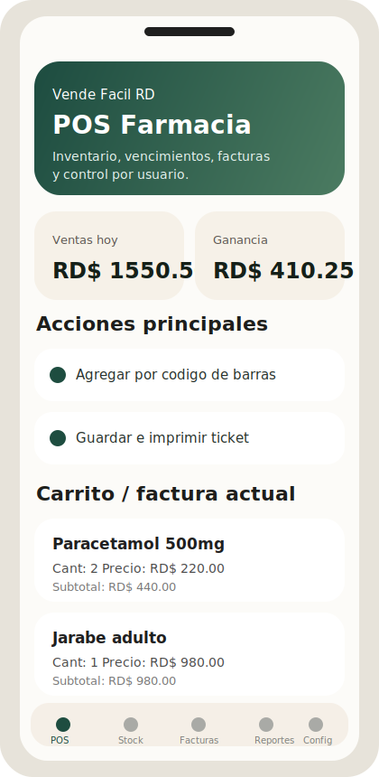
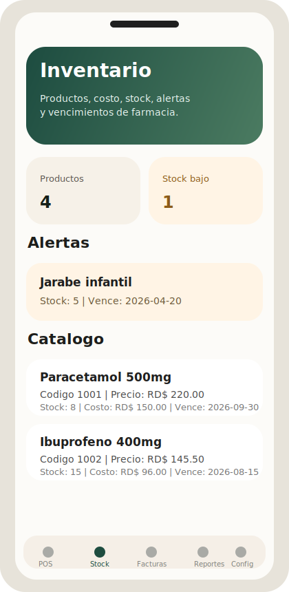
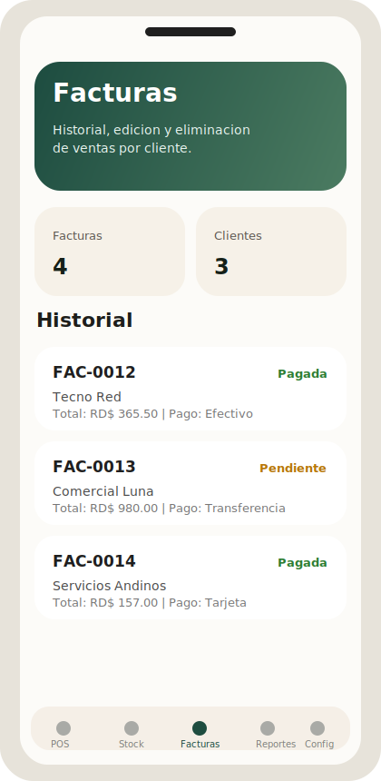
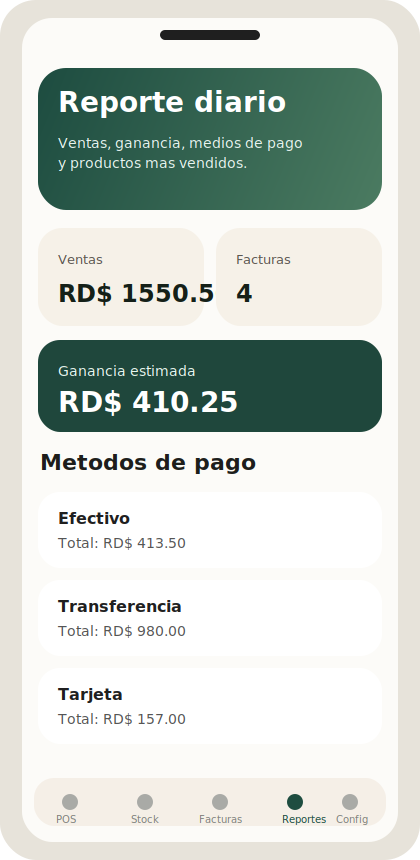
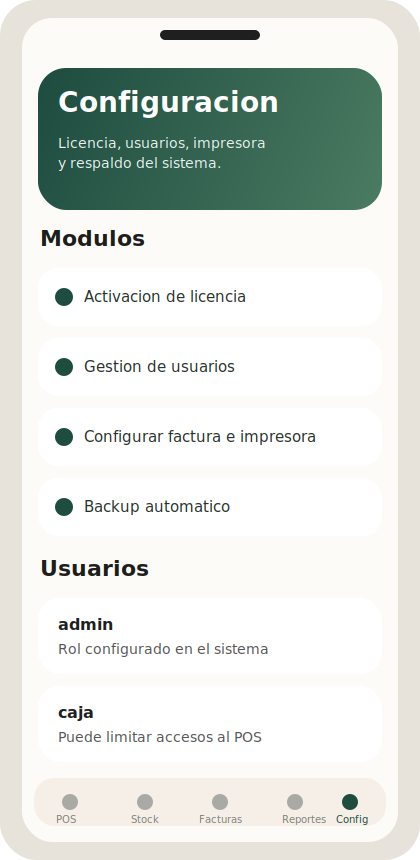

# Facturacion Android

Aplicacion Android en desarrollo inspirada en un sistema de ventas de escritorio para farmacia.  
El objetivo es transformar ese flujo de trabajo en una experiencia movil moderna, clara y lista para crecer por modulos.

Repositorio base: [Facturacion-Android](https://github.com/ronal05101989/Facturacion-Android)

## Descripcion

Esta app toma como referencia funcional el sistema Python:
`vende_facil_rd_farmacia_vencimiento_autofecha.py`

La idea no es solo copiar la interfaz antigua, sino reorganizarla para Android con una navegacion mas limpia, mejor experiencia tactil y una estructura preparada para futuras mejoras como base de datos local, login real, reportes y emision de facturas.

## Modulos principales

- `POS`: venta rapida, carrito, total, devuelta e impresion.
- `Stock`: productos, costos, stock bajo y vencimientos.
- `Facturas`: historial de ventas, detalle, edicion y eliminacion.
- `Reportes`: ventas del dia, ganancia, medios de pago y productos mas vendidos.
- `Configuracion`: licencia, usuarios, datos del negocio, impresora y backup.

## Inspiracion del sistema original

Del sistema Python original se identificaron estas funciones clave:

- activacion de licencia
- login de usuarios y roles
- punto de venta
- inventario con vencimientos
- historial y edicion de facturas
- reporte diario
- configuracion de ticket
- backup automatico

La equivalencia entre el sistema Python y la version Android se documento en:

- [docs/python-to-android-map.md](./docs/python-to-android-map.md)

## Vista previa visual

### POS

### Stock

### Facturas

### Reportes

### Configuracion

## Estructura del proyecto

- `app/src/main/java/com/playground/facturacion/MainActivity.kt`: punto de entrada de la app.
- `app/src/main/java/com/playground/facturacion/ui/FacturacionApp.kt`: navegacion principal y pantallas base.
- `app/src/main/java/com/playground/facturacion/ui/data/SampleData.kt`: datos demo para construir la interfaz.
- `app/src/main/java/com/playground/facturacion/ui/model`: modelos base del dominio.
- `docs/python-to-android-map.md`: puente conceptual entre el sistema Python y la app Android.

## Tecnologias usadas

- Kotlin
- Android
- Jetpack Compose
- Material 3
- Navigation Compose
- Gradle Kotlin DSL

## Estado actual

Actualmente el proyecto incluye:

- estructura base de app Android
- navegacion principal por modulos
- interfaz inicial inspirada en el sistema Python
- mockups visuales para referencia
- documentacion para continuar el desarrollo

Todavia no incluye:

- login funcional
- persistencia real con Room
- impresion real
- lectura de codigo de barras
- sincronizacion con servicios externos

## Proximos pasos recomendados

1. Implementar `Login + roles`.
2. Construir el `POS` real con carrito y busqueda de productos.
3. Agregar persistencia local con `Room`.
4. Implementar inventario con alertas de vencimiento.
5. Crear historial y detalle editable de facturas.
6. Añadir reporte diario con filtros.
7. Integrar impresion y exportacion.

## Ejecucion local

Para abrir el proyecto en Android Studio:

1. Instala Android Studio.
2. Abre esta carpeta como proyecto.
3. Instala un SDK Android reciente desde el SDK Manager.
4. Si hace falta, crea `local.properties` a partir de `local.properties.example`.
5. Sincroniza Gradle.
6. Ejecuta la app en un emulador o dispositivo fisico.

## Nota importante

En este entorno no se pudo ejecutar la app porque la maquina aun no tiene Android Studio, Java ni Android SDK configurados.  
Por eso las vistas actuales en el repositorio se muestran como mockups y estructura de interfaz lista para continuar.
